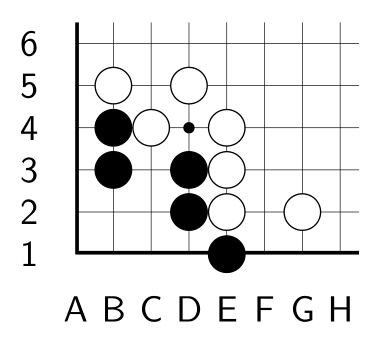
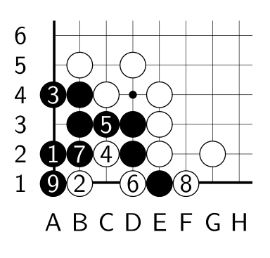
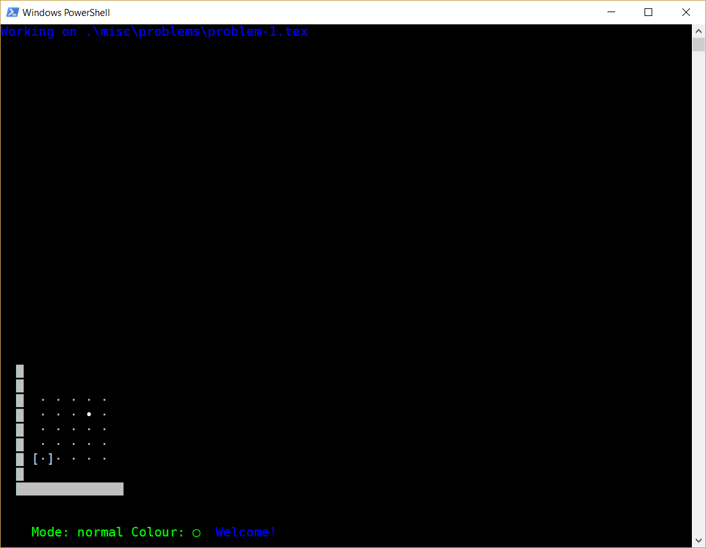
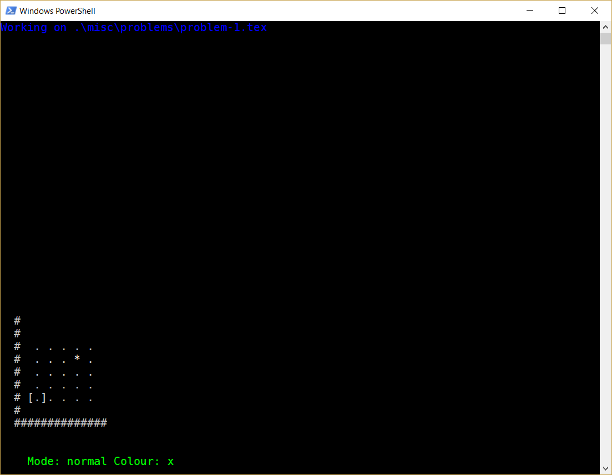
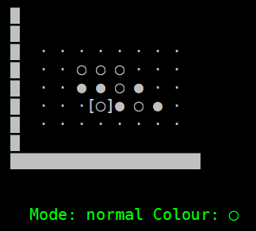
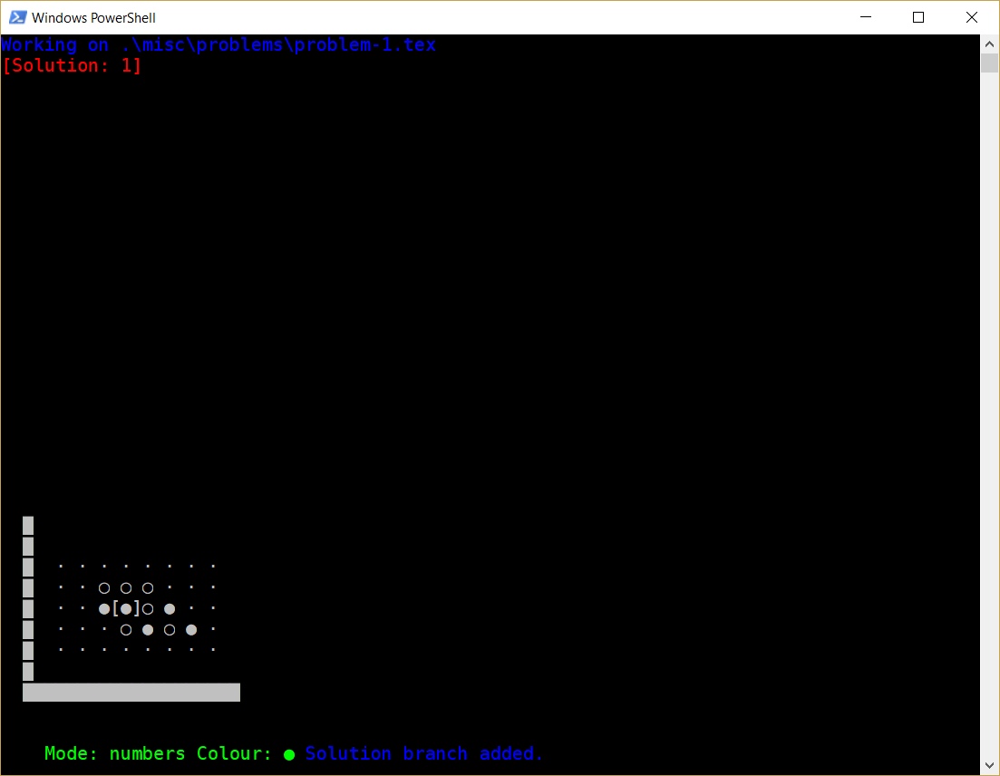

`psgo_emitter` is a (Windows) console utility to create go diagrams for go life-and-death problems (tsumego).

# Requirements

* Unless you are using pre-built executable, you'll need Python 3 and `asciimatics` package.

* I recommend to use in a console window some font with good unicode support; "DejaVu Sans Mono" is what I am using (but see `d` below in "Keybindings").

* LaTeX and [psgo](https://ctan.org/tex-archive/graphics/pstricks/contrib/psgo/) package to use the resulting files. I recommend to use [MiKTeX distribution](https://miktex.org) unless you know what you are doing.

# Limitations and/or TODOs

* NO UNDO

* Only positions in the bottom left corner are supported.

* Nothing like marks, etc. Just black and white stones. Numbered stones in solution diagrams.

* Maximum 9 numbered stones per solution diagram.

# Examples of the result

## LaTeX code emitted

For the problem:

        \begin{psgopartialboard}{(1,1)(8,6)}
                \stone{black}{b}{3}
                \stone{black}{d}{3}
                \stone{black}{b}{4}
                \stone{white}{d}{5}
                \stone{white}{g}{2}
                \stone{black}{d}{2}
                \stone{white}{b}{5}
                \stone{white}{c}{4}
                \stone{white}{e}{4}
                \stone{white}{e}{3}
                \stone{white}{e}{2}
                \stone{black}{e}{1}
        \end{psgopartialboard}

For the solution:

        \begin{psgopartialboard}{(1,1)(8,6)}
                \stone{black}{b}{3}
                \stone[\marklb{1}]{black}{a}{2}
                \stone{black}{d}{3}
                \stone{black}{b}{4}
                \stone[\marklb{8}]{white}{f}{1}
                \stone[\marklb{6}]{white}{d}{1}
                \stone{white}{e}{2}
                \stone{white}{g}{2}
                \stone{black}{d}{2}
                \stone{white}{b}{5}
                \stone[\marklb{7}]{black}{b}{2}
                \stone[\marklb{9}]{black}{a}{1}
                \stone{white}{c}{4}
                \stone[\marklb{4}]{white}{c}{2}
                \stone{white}{e}{4}
                \stone[\marklb{5}]{black}{c}{3}
                \stone{white}{e}{3}
                \stone[\marklb{2}]{white}{b}{1}
                \stone{white}{d}{5}
                \stone[\marklb{3}]{black}{a}{4}
                \stone{black}{e}{1}
        \end{psgopartialboard}

## Result after running LaTeX

# Usage

Run the program from a console window.

The program accepts two optional arguments:

* the common part of file names to write (`-[sequential number].tex` will be added to it. By default the files will be written in the current directory, with the names `YYYY-mm-dd-HH-MM-problem-[sequential number].tex` where `YYYY-mm-dd-HH-MM` is the date and time when the program was started.
* the first sequential number to use; `1` by default.

# User guide

**THERE IS NO UNDO AT ALL**

## UI introduction

After you run the program, you will see a window. On top it displays the file name you are working on. On the bottom you see status line, which consists of

* mode indicator (normal, paint, erase or numbers)
* current chosen colour (black or white; initially black)
* message line (here you will see informational messages, warnings and errors)

Above the status line you see the bottom left corner of a go board. The cursor (denoted with square brackets, `[ ]`) shows the currently selected point.

**If the board looks bad** it probably means that your font does not have (wide enough) unicode support. Press `d` to switch to ascii display mode (press it again to go back to unicode mode).

**To exit the program** press `Q` (notice the uppercase).

## Setting up the main position

### Moving around and adding stones in normal mode

The selected point can be moved using arrow keys; the displayed corner of the board will resize dynamically. To add the stone of currently selected colour, press `space`. To change the currently selected colour, press `x` or `s` (`s` not only changes the currently selected colour, but also changes the colour of the stone at selected point; `x` does not touch the stoses). To remove the stone, press `space` on it again.

### Paint and erase modes

In paint mode (to turn it on, press `p`) the stones with selected colour are immediately added to the board when you move the cursor. In erase mode (hotkey is `e`) the stones are removed from the board when you move the cursor. To go back to normal mode, press `n`. To cycle through the modes press `m` (I have no idea why you may want to do that, though).

## Solutions

Solution support is very limited. Basically, "solution" is the main position with few (no more than 9) numbered stones added. For one main position you may have multiple solutions.

### Solution branches

To add a solution to the main position, press `A`. The number of solution will be displayed just below the top line of the screen, and the mode will be changed to "numbers".

To add more solution branches, press `A` again. To cycle between main position and solution branches, use `N` for the next branch and `P` for the previous one. To delete the current solution branch, press `D`.

### Adding stones to solutions

You can still move around with the arrows, but the procedure of adding the stones is different. You cannot add non-numbered stones in solution branch; to add a numbered stone press a digit from `1` to `9`. The white stones are denoted by yellow digits, and the black one by blue digits.

To remove the numbered stone, press `0`. When working on solution branch, you cannot touch normal (non-numbered) stones; however, you can add numbered stone on top of a normal one. When you add a numbered stone, the currently selected colour is automatically changed: if you press `1` and then `2`, the added stones will be of different colour.

To change:

* Colour of numbered stone under the cursor: press `space`
* Currently selected colour: press `x`
* Currently seceted colour and update the colour of numbered stone under the cursor: press `s`

## Export options

### Clipboard

To copy the TeX code for *the main position only* to the Windows clipboard, press `c`.

### Write files

To write the main position and solution positions for all solution branches to files, press `w`. The files for problems are named sequentially; solution files have added `-sol-[solution number]`.

## Misc

To clear the board and start anew, press `C` (you want to do this after writing files to move to the next problem).

## Using LaTeX

See some skeleton LaTeX code in `misc/`.
